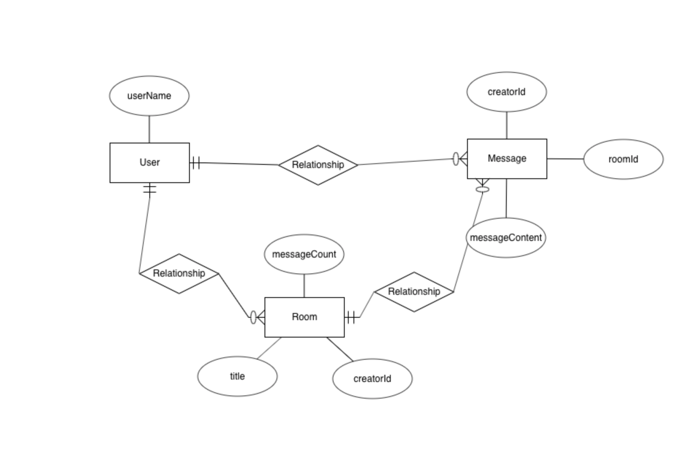
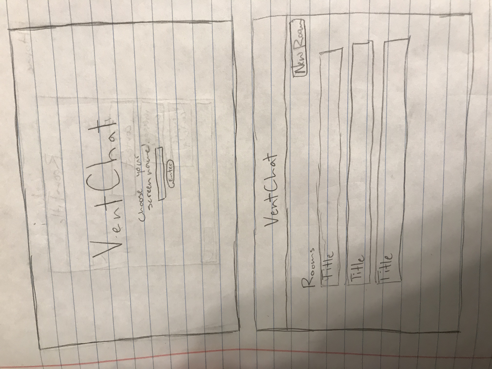
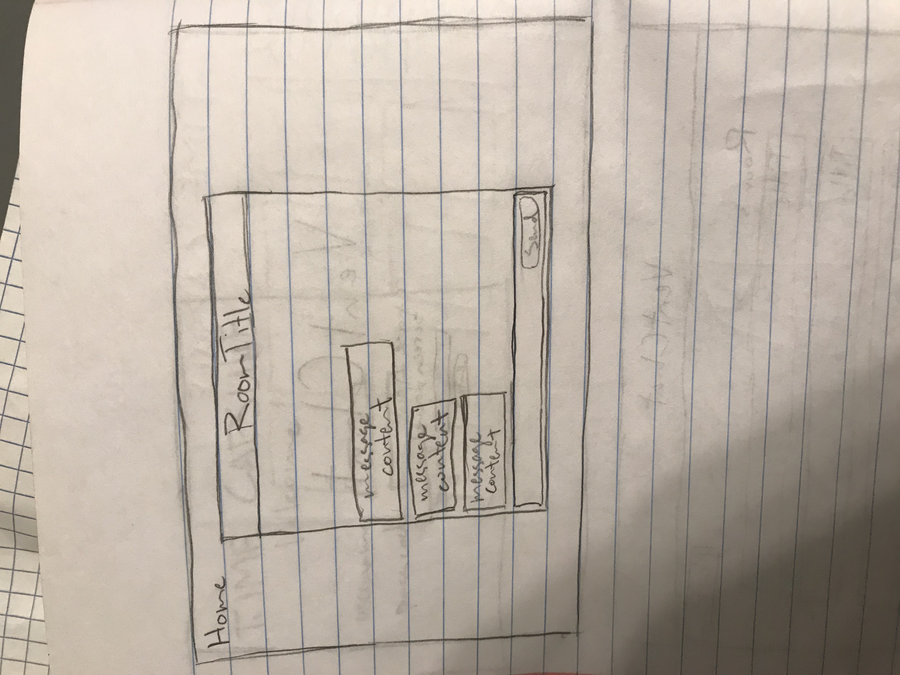

A chat app for people who seriously need to vent. Some people have very stressful jobs and lives
and need to let off steam after dealing with their daily items, but have no one to speak about it with. Enter my app. The end user for my app is someone who deals with stressful things on a daily basis and has no one to vent to about it to. Welcome to VentChat!

[Wireframe 1](https://drive.google.com/file/d/0B81SnKoP-KWXWlRqaWIyZmtuR3A1dUdHdEtFbU5KdjlnclhN/view?usp=sharing)
[Wireframe 2](https://drive.google.com/file/d/0B81SnKoP-KWXZWs3YXM5bDhKdHBYVENzaG92Y2J4cHFpXy13/view?usp=sharing)

[ERD](https://erdplus.com/edit-diagram/aeedfc05-4591-49ea-b312-c5292e83feef)

[Heroku](https://vent-chat.herokuapp.com/)

[Trello Project board](https://trello.com/b/oq4G00U7/ventchat)

ERD

Wireframes

